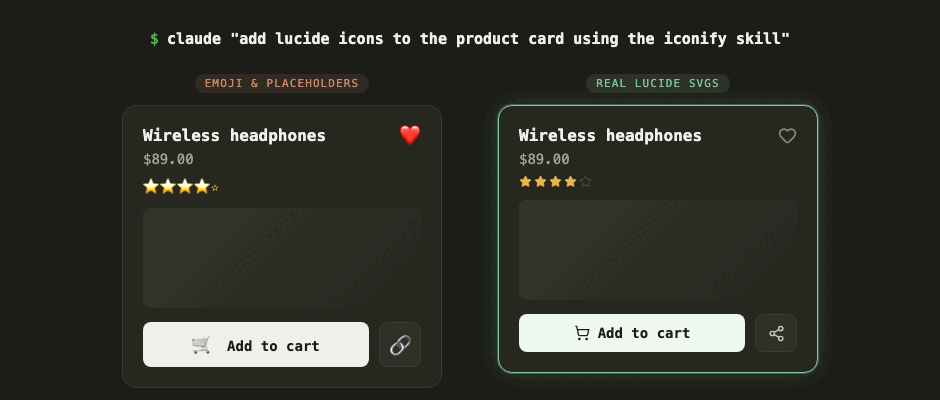

# iconify-skill

A [Claude Code](https://docs.claude.com/en/docs/claude-code) skill for searching and downloading 200,000+ open-source SVG icons via the [Iconify API](https://iconify.design).

Stop letting Claude hand-draw SVG paths or drop emoji into your UI. With this skill, Claude fetches real icons from Lucide, Material Design, Tabler, Phosphor, and 150+ other sets — consistent, professionally designed, correctly proportioned.

No API key required.



## Install

```bash
git clone https://github.com/amalshehu/iconify-skill.git ~/.claude/skills/iconify
```

That's it. Requires `curl` and `jq`.

## Usage

Claude uses it automatically when building UIs — just ask:

```bash
claude "add lucide icons to the product card using the iconify skill"
```

Claude invokes the skill, searches Iconify, and downloads the SVGs — no manual steps needed. The image above shows the difference: emoji and mismatched glyphs (left) versus consistent Lucide SVG icons (right), same card either way.

You can also drive the scripts directly:

```bash
# Search across all icon sets
bash ~/.claude/skills/iconify/scripts/search.sh "shopping cart" 20

# Search within one set for visual consistency
bash ~/.claude/skills/iconify/scripts/search.sh "arrow" 20 lucide

# Download as SVG
bash ~/.claude/skills/iconify/scripts/get.sh lucide:shopping-cart cart.svg 24 currentColor
```

See [SKILL.md](SKILL.md) for details.

## Credits

Icons served by [Iconify](https://iconify.design). Individual icon sets are open source (MIT, Apache 2.0, CC, OFL) — check set licenses at [icon-sets.iconify.design](https://icon-sets.iconify.design) for attribution requirements.

## See also

- [pexels-skill](https://github.com/amalshehu/pexels-skill) — royalty-free stock photos for Claude Code, same zero-friction formula.
